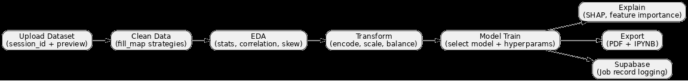
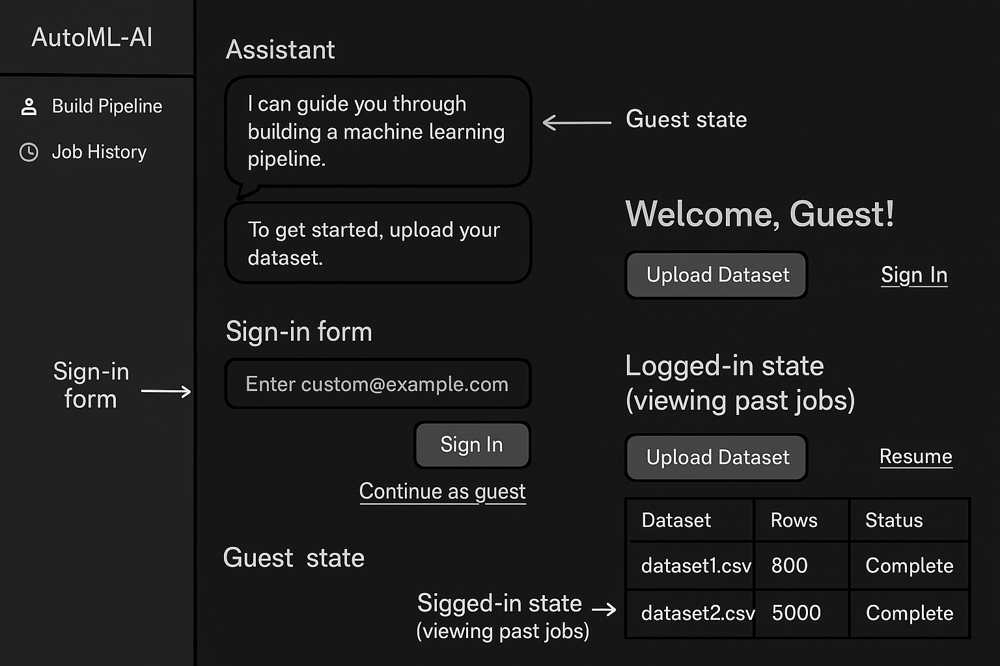

# AutoML-AI (Backend)

🎯 An AI-assisted backend to help users train supervised machine learning models step-by-step — from dataset upload to model export — using FastAPI and Groq.

---

## 🚀 Features

- 📁 CSV/XLSX Upload with schema preview
- 🧹 Missing value handling (mean/median/mode/drop)
- 📊 EDA: Correlation, skewness, class balance
- 🧬 Transformation: Encoding, Scaling, SMOTE
- 🤖 Train: Logistic, RF, SVM, XGBoost, LightGBM, KNN, etc.
- 📈 Evaluation: Accuracy, Precision, Recall, F1, AUC
- 📄 Export: PDF Report & IPYNB Notebook
- 💡 Groq AI Assistant: Insightful suggestions at each step
<!-- - 🔍 SHAP-based model explainability and feature importance -->
- 🧠 UUID-based anonymous usage (no login required)
<!-- - 🔐 Optional login via Supabase Auth
- 🧾 Logged-in users get full session history and resume support -->

---

## 🧱 Tech Stack

- FastAPI (Python)
- Pandas, Scikit-learn, Imbalanced-learn, SHAP
- fpdf2, nbformat (for exports)
- aiohttp (for Groq streaming)
- Supabase (PostgreSQL + Auth)
- Hosted on: Heroku eco-tier

---

## 🛠 Setup

### 1. Clone the Repo

```bash
git clone https://github.com/ro-rok/automl-ai.git
cd automl-ai-backend
```

### 2. Create Virtual Environment

```bash
python -m venv venv
# Windows:
.venv\Scripts\Activate.ps1
# Mac/Linux:
source venv/bin/activate
```

### 3. Install Requirements

```bash
pip install -r requirements.txt
```

### 4. Set Environment Variables

Create a `.env` file:

```env
GROQ_API_KEY=your_groq_key_here
SUPABASE_URL=https://your-project.supabase.co
SUPABASE_KEY=your_service_role_key
SUPABASE_ANON_KEY=your_anon_key
```

---

## ▶️ Run the API Server

```bash
uvicorn app.main:app --reload
```

---

## 📬 API Routes Summary

| Endpoint              | Description                            |
|-----------------------|----------------------------------------|
| `/upload/file`        | Upload dataset + preview schema        |
| `/pipeline/clean`     | Clean missing values                   |
| `/pipeline/eda`       | Perform EDA                            |
| `/pipeline/transform` | Encode/scale/balance features          |
| `/pipeline/train`     | Train model & return metrics           |
| `/export/pdf`         | Export as PDF                          |
| `/export/ipynb`       | Export as notebook                     |
| `/groq/suggest`       | Assistant suggestion (streaming)       |
<!-- | `/user/history`       | View user’s job history (auth only)    | -->
<!-- | `/pipeline/explain`   | SHAP feature importance                | -->
---

## 🔄 Visual Pipeline Flow

Gain insight into the step-by-step journey from data upload to actionable model insights. This visual guide illustrates the progression through data cleaning, transformation, training, and evaluation.

- Understand how raw data evolves into a robust ML model.
- Monitor each phase of your pipeline with clarity.
- Identify key transformation points for troubleshooting.

Take a closer look at the flow and let it guide you through an efficient, user-friendly pipeline experience.


---

## 📬 Supabase Integration

- Stores session job metadata with pipeline configs, model, and evaluation metrics.
- Table: `ml_jobs` (with fields: `id`, `filename`, `n_rows`, `pipeline`, `metrics` etc.)


---

## 🧠 User Modes

| Feature            | Guest User | Logged-in User |
|--------------------|------------|----------------|
| Upload + Train     | ✅         | ✅              |
| Export Code/PDF    | ✅         | ✅              |
| Job History View   | ❌         | ✅              |
| Resume Pipelines   | ❌         | ✅              |

---

## 🧾 Visual: UI State Flow

- Guest user lands on homepage, greeted with assistant prompt
- Option to continue anonymously or sign in via email
- Signed-in users see job history + resume option

 

---

## 🚀 Future Enhancements

We are continuously evolving AutoML-AI. Upcoming features include:
- **SHAP Explainer Integration:** Enhance model explainability and provide deeper insights.
- **User-friendly Login Page:** A seamless sign-in experience for personalized session management.

Stay tuned for more improvements!

<!-- ## 🔍 Explainability

- Supports SHAP-based feature importance on any trained model.
- Auto-detects model type for TreeExplainer vs default Explainer.

--- -->


Built with ❤️ by Rohan
